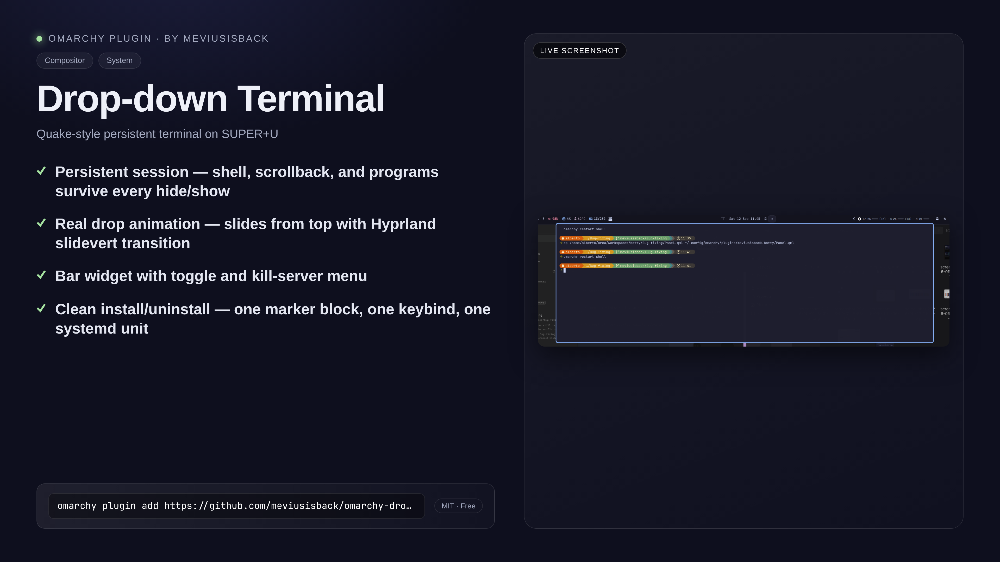

# Drop-down terminal (meviusisback.dropdown-terminal)

A drop-down terminal for Omarchy: press **SUPER + U** and a terminal slides
down from the top of your screen, centered and slightly narrower than the
display. Press again and it slides back up. The session is **persistent** -
shell, scrollback and running programs survive every hide/show, workspace
switch, and even a shell restart.



## Features

- **Persistent session** - powered by a `foot` terminal *server* (systemd user
  unit). Hiding the dropdown never kills your session; only logout or an
  explicit kill does. If the server ever dies, the next toggle self-heals it.
- **Real drop animation, from the top** - the terminal lives on its own special
  workspace at the top edge; toggling plays Hyprland's `specialWorkspace`
  animation (easeOutQuint) with the direction pinned explicitly, so the panel
  **drops in from the top** and retracts upward, instead of Hyprland's default
  motion for special workspaces (a bare `slidevert` rises from the bottom).
- **Centered geometry** - 80% width, 45% height, just below the top bar, with
  a rounded 3px border. Geometry is expressed in `monitor_w/H` formulas, so it
  adapts to any monitor/resolution change without reinstalling.
- **Click outside to dismiss** - a focus watcher hides the dropdown the moment
  it loses focus. It is **event-driven**: the watcher subscribes to Hyprland's
  event socket (`activewindow` / `activespecial`), so it costs nothing while you
  work instead of polling the compositor several times a second. Dismissal is
  click-based: the plugin sets `input:follow_mouse = 0` and
  `float_switch_override_focus = 0` so moving the mouse never steals focus, and
  `input:special_fallthrough` lets your click reach the window underneath.
- **Bar widget** - shows terminal state at a glance (accent = shown). Left
  click toggles, right click opens a small menu (show/hide, kill server). The
  state is event-driven too: the watcher publishes it to a small file the widget
  watches, so there is no periodic status poll.
- **IPC control** - `omarchy-shell shell toggle meviusisback.dropdown-terminal`
  plus `open`, `close`, `kill`, `status` methods.
- **Clean install/uninstall** - one marker-anchored block in your Hyprland
  config, one line, one systemd unit. Uninstall removes every trace.

## Requirements

- **Omarchy** with its Hyprland build - toggling uses the Lua dispatch engine
  (`hl.dsp.workspace.toggle_special`), not the legacy
  `dispatch togglespecialworkspace` syntax.
- **foot** - provides `foot` and `footclient` (Arch: `pacman -S foot`). The
  persistent session is a foot *server*; your own foot config and windows stay
  untouched, because the dropdown uses its own app-id and socket.
- **systemd user instance** - the session lives in the user unit
  `foot-server@dropdown-terminal.service`.
- **python3** and **bash** at their absolute system paths (`/usr/bin/python3`,
  `/usr/bin/bash`) - standard library only; the backend, the watcher and the CLI
  use no third-party packages. The plugin resolves every tool it runs to a
  validated absolute path and never through `PATH` (see *Notes* below), so a
  layout that keeps them elsewhere is not supported.
- **omarchy-shell** - for the bar widget and the
  `omarchy-shell shell toggle meviusisback.dropdown-terminal` IPC method.

Everything runs in your own user session: no network access, no root, no
long-lived daemon beyond the foot server unit.

## Install

```bash
omarchy plugin add https://github.com/meviusisback/omarchy-dropdown-terminal
omarchy plugin enable meviusisback.dropdown-terminal   # adds the bar widget
cd ~/.config/omarchy/plugins/meviusisback.dropdown-terminal
./install.sh                                           # keybind + rules + foot server
```

`omarchy plugin add` only puts the files on disk; `./install.sh` is the part a
plugin cannot do for itself (writing your Hyprland config and enabling a user
unit).

What it does:

1. Installs a parameterized systemd user unit `foot-server@.service`
   (backing up any pre-existing file of that name) and enables the
   `dropdown-terminal` instance - a persistent `foot` server with a dedicated
   app-id (`org.omarchy.dropdown-terminal`) and its own socket, so it never
   touches your normal foot setup.
2. Writes `~/.config/hypr/dropdown-terminal.lua` (window rules) and hooks it
   into `~/.config/hypr/hyprland.lua` (same pattern as the Omarchy
   workspace-layout plugin).
3. Appends a marker-anchored keybind block to `~/.config/hypr/bindings.lua`:
   `SUPER + U` -> `omarchy-dropdown-terminal toggle`.
4. Reloads Hyprland. Press **SUPER + U**.

### Uninstall

```bash
./install.sh uninstall                               # keybind, rules, unit, server
omarchy plugin remove meviusisback.dropdown-terminal # plugin files + bar entry
```

Stops and disables the server (ordered to defeat the systemd respawn race),
removes the keybind block, the hook lines, the rules file and the unit.

## Usage

| Key / action | Effect |
|---|---|
| `SUPER + U` | Toggle the drop-down terminal |
| Bar icon click | Toggle |
| Bar icon right-click | Menu: show/hide, kill server |
| `omarchy-shell shell toggle meviusisback.dropdown-terminal` | Toggle via IPC |

CLI (`bin/omarchy-dropdown-terminal`, on PATH once enabled as a plugin):

```
toggle   show/hide the drop-down terminal (default)
open     show it if hidden
close    hide it if shown
status   print JSON state (server, window, visibility)
kill     stop the foot server (ends the session)
install  install keybind + rules + systemd unit
uninstall remove everything the plugin installed
```

## How it works

```
SUPER+U  ->  omarchy-dropdown-terminal toggle        (every tool resolved to a
              |-- systemctl --user start foot-server@...   validated absolute path,
              |                                             never through PATH)
              |-- footclient -> attaches to the persistent server
              '-> hyprctl dispatch 'hl.dsp.workspace.toggle_special("dropdown")'
                    (specialWorkspaceIn/Out animation: drops in from the top)

Hyprland event socket ($XDG_RUNTIME_DIR/hypr/<signature>/.socket2.sock)
   '-- backend/focus_watcher.py (one long-lived process, no polling)
         |-- activewindow >> class != org.omarchy.dropdown-terminal
         |     -> hide through the CLI (same guarded dispatch as above)
         '-- activespecial >> special:dropdown | (empty)
               -> publish visibility to $XDG_RUNTIME_DIR/dropdown-terminal.state
                     '-- the bar widget watches that file for its icon state
```

The foot server keeps ONE long-lived Wayland client alive. Every dropdown
summon attaches a `footclient` to it through a dedicated socket
(`$XDG_RUNTIME_DIR/foot-dropdown-terminal.sock`, i.e. systemd's `%t` - the user
manager's runtime directory, which is what the unit binds), so startup is instant
and the shell session (scrollback, vim, ssh...) persists as long as the server
does. The dedicated app-id scopes the window rules to this terminal only -
your regular foot windows are untouched.

## Not supported / notes

- Only one dropdown window at a time (by design - it's a Quake dropdown).
- Wayland-only (Hyprland). X11 is not supported.
- The bar widget's state is event-driven: the watcher publishes
  `$XDG_RUNTIME_DIR/dropdown-terminal.state` (0600, written atomically, and only
  when visibility actually changes) whenever the dropdown is shown or hidden, and
  the widget watches that file - no polling. The path is not guessed on either
  side: the widget asks the CLI (`state-path`), the CLI asks the backend, and the
  backend validates the directory once for all three consumers (absolute, owned by
  you, no group/other bits, ancestors not writable by others, and not `$HOME`). The
  same query answers the foot client socket path (`socket-path`) - in systemd's
  `%t`, which is what the server unit binds - so the directory rules and both
  filenames live in one place and cannot drift apart.
  If no directory qualifies, the systemd path is used when it passes the same
  rules, and otherwise the widget reconciles against the CLI every 30 s instead of
  showing a stale icon.
- Dismissal is **click-based**: clicking another window closes the dropdown and
  focuses that window. Clicking *bare desktop background* (no window under the
  cursor) raises no Hyprland event, and clicking the bar does not move keyboard
  focus, so neither closes it - use `SUPER + U` for those.
- **No `PATH`, minimal environment, bounded output.** The watcher, the backend
  and the CLI resolve every tool they run (`python3`, `bash`, `hyprctl`,
  `systemctl`, `footclient`, `setsid`, `rm`, ...) to a validated absolute path
  from a fixed list of root-owned directories, and refuse anything owned by
  another user, group/world-writable, not a regular file, or reached through a
  directory chain that is not equally trusted. The CLI and the watcher are started
  with a cleared environment and **no `PATH` at all**, so a malicious earlier entry
  cannot be launched by enabling the widget - there is nothing to look up. The
  installed keybind also calls the CLI by its absolute `~/.local/bin` path, because
  Omarchy turns a string dispatcher into a shell command (`hl.dsp.exec_cmd`); the
  one hard-coded path in the automatic path is `/usr/bin/env`, which runs the
  watcher with that cleared environment (`-i`, only the variables it needs) and an
  isolated interpreter (`-I -E -S`). Something must be the first exec, so it stops
  at a root-owned system path. Python-side children get an environment allowlist
  plus a `PATH` built only from directories that actually validate, and captured
  output is capped at 256 KiB with the process group killed on overflow or timeout
  and then reaped.
- The focus watcher subscribes to Hyprland's event socket instead of polling
  (idle cost is one liveness round trip per minute, versus ~430k `hyprctl` spawns
  per day when polled at 5 Hz). If the socket is missing, stale or silent, it
  degrades to a 2 s poll and returns to the event path as soon as the socket
  accepts a connection again - dismissal never depends on the event path working,
  and a failed probe is never mistaken for the user focusing another window.
- `omarchy plugin validate .` and the unit tests below cover these guarantees.
- `install` never overwrites a config file it cannot read: `hyprland.lua` or
  `bindings.lua` that is unreadable or implausibly large (> 1 MiB) makes it abort
  with an error instead of replacing your file with this plugin's marker block.
- The plugin sets three global input options in
  `~/.config/hypr/dropdown-terminal.lua`: `special_fallthrough = true`,
  `follow_mouse = 0` and `float_switch_override_focus = 0`. The last two turn
  off hover-to-focus **for the whole desktop** (focus changes on click only) -
  that is what makes dismissal click-based. Uninstall removes them. To keep
  hover-to-focus, delete that `hl.config` block and set
  `special_fallthrough = true` yourself; dismissal then reverts to
  closing as soon as the mouse leaves the dropdown.
- The plugin also pins the drop direction for the `specialWorkspaceIn` and
  `specialWorkspaceOut` animation leaves in that same generated file
  (`slidevert top` on show, `slidevert bottom` on hide). Animations are global
  per leaf, so **every** special workspace on that monitor - the Omarchy
  scratchpad (`SUPER + S`) included - drops in from the top once installed; the
  engine offers no per-workspace animation override. Uninstall removes the
  block. Delete the `hl.animation` lines to get Hyprland's default motion back
  (special workspaces rising from the bottom). Marking those two leaves also
  detaches them from Omarchy's own `specialWorkspace` line: later changes there
  (speed, bezier) no longer reach them, so revisit this block if you reshuffle
  your animations. The bezier is Omarchy's curve - if it ever stops resolving,
  `hyprctl configerrors` reports it and the direction simply is not applied.

## Tests

Host-static - no compositor needed, and hermetic (the suite repoints `HOME` and
records instead of running `systemctl`):

```bash
python3 tests/test_backend.py        # 46 - config writes, idempotency, unit + tool resolution
python3 tests/test_proc.py           # 20 - trusted-path resolver, bounded output, timeouts
python3 tests/test_focus_watcher.py  # 39 - event state machine, path validation, state file, socket
```

## License

MIT - see [LICENSE](LICENSE).
